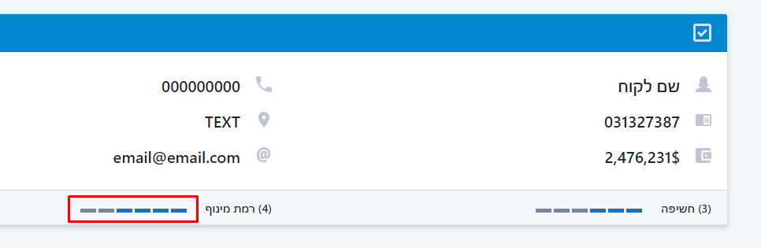

# Javascript Square Rater Plugin

## Screenshot

### Usage
CSS - `<link rel="stylesheet" href="path/square-rater/square-rater.css">`

HTML - `

`

Javscript - ``

### Versions
v1.0 (simple version - only show the rate) - 2020.3.24

### Contact
* live:.cid.4138a976227638ac (skype)
* royal2710@outlook.com (email)
* https://github.com/royal2710 (github)